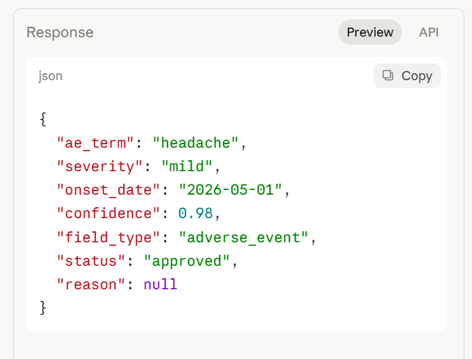

# Case 1 — Clear adverse event note

## Input
Patient reported a mild headache. Onset was 2026-05-01.
Severity described as mild by the patient during visit 2.

## Output

## Result
| Field      | Value      |
|------------|------------|
| ae_term    | headache   |
| severity   | mild       |
| onset_date | 2026-05-01 |
| confidence | 0.98       |
| status     | approved   |
| reason     | null       |

## Why this result
All three required fields — AE term, severity, and onset date — are
explicitly stated in the note. Confidence 0.98 exceeds the 0.92
adverse_event threshold so the output is approved automatically
with no HITL review required.

## Clinical significance
This is the target behavior for a well-documented clinical note.
The extraction goes directly to the EDC without human intervention,
reducing CRA workload on standard visits while maintaining data integrity.