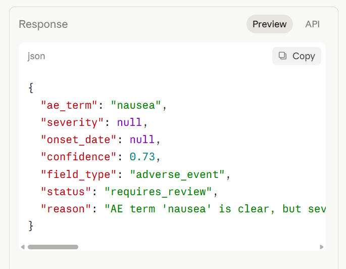

# Case 2 — Ambiguous onset date

## Input
Subject mentioned some nausea after the last dose.
Date unclear, possibly last Tuesday.

## Output

## Result
| Field      | Value           |
|------------|-----------------|
| ae_term    | nausea          |
| severity   | null            |
| onset_date | null            |
| confidence | 0.73            |
| status     | requires_review |
| reason     | see screenshot  |

## Why this result
The AE term is identifiable but the onset date is ambiguous —
"possibly last Tuesday" cannot be converted to a reliable YYYY-MM-DD
value without additional confirmation. Severity is not stated.
Confidence 0.73 falls below the 0.92 threshold so the output is
routed to the HITL review queue.

## Clinical significance
This represents a common real-world documentation gap. The agent
correctly escalates rather than fabricating a date, which would
introduce a data integrity violation. A human reviewer retrieves
the exact date from the source document before approving the record.