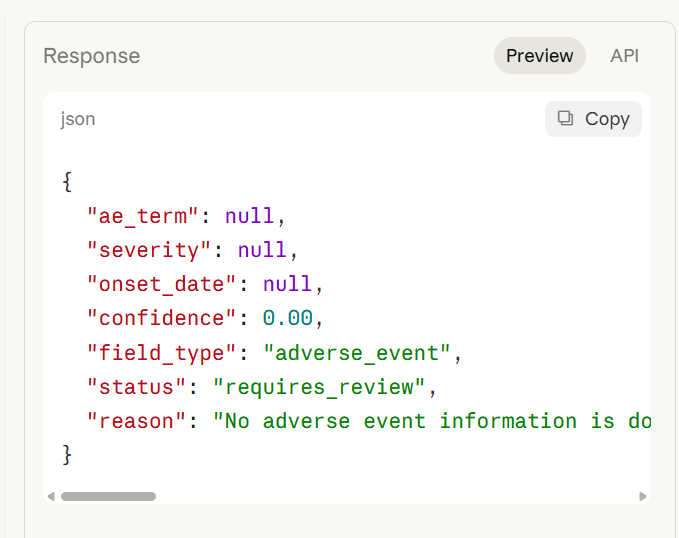

# Case 3 — Vague note with no extractable data

## Input
Patient seems to be doing okay overall.
Nurse noted something in the sidebar but it was not captured formally.

## Output

## Result
| Field      | Value           |
|------------|-----------------|
| ae_term    | null            |
| severity   | null            |
| onset_date | null            |
| confidence | 0.00            |
| status     | requires_review |
| reason     | see screenshot  |

## Why this result
No adverse event is formally documented. The reference to an
uncaptured nurse observation provides no extractable data.
Confidence 0.00 is the lowest possible score — the agent has
no basis for extraction. The PROHIBITED clause prevented
fabrication of any field value.

## Clinical significance
This is the GxP safety net working as designed. A confidence of
0.00 means fabricating an AE term here would introduce a false
record into the EDC — a serious GCP violation. The correct
behavior is full escalation to human review with a clear
explanation of why no data could be extracted.